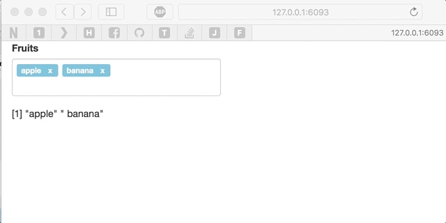

<!-- README.md is generated from README.Rmd. Please edit that file -->

```{r, echo = FALSE}
knitr::opts_chunk$set(
  collapse = TRUE,
  comment = "#>",
  fig.path = "README-"
)
```

```{r, eval=FALSE}
library(shiny)
ui <- fluidPage(
  tagsTextInput("fruits", "Fruits", "apple, banana"),
  textOutput("out")
)

server <- function(input, output){
  output$out <- renderPrint( strsplit( input$fruits, ",")[[1]] )
}

shinyApp( ui, server )
```



