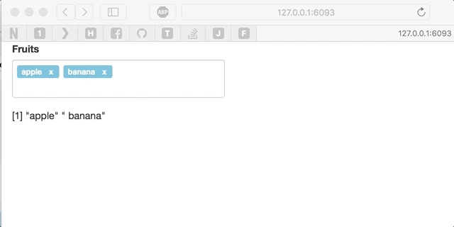

<!-- README.md is generated from README.Rmd. Please edit that file -->
``` r
library(shiny)
ui <- fluidPage(
  tagsTextInput("fruits", "Fruits", "apple, banana"),
  textOutput("out")
)

server <- function(input, output){
  output$out <- renderPrint( strsplit( input$fruits, ",")[[1]] )
}

shinyApp( ui, server )
```


